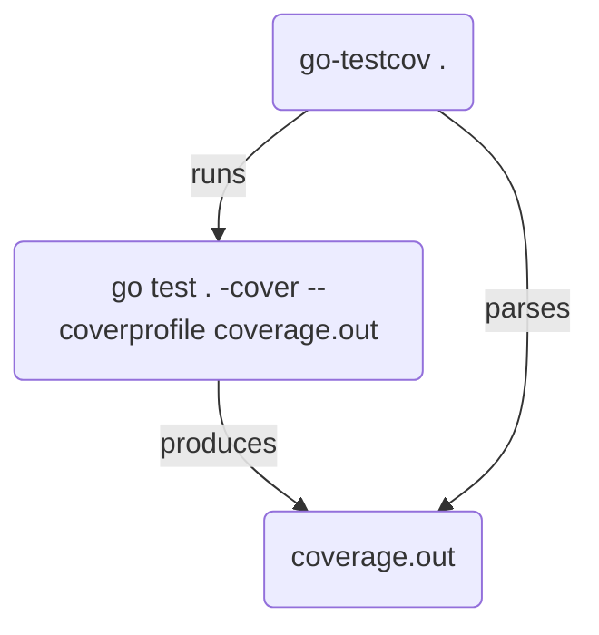

# go-testcov [](https://github.com/grosser/go-testcov/actions?query=branch%3Amaster) [](https://github.com/grosser/go-testcov)

`go test` that fails on untested lines and shows them

 - 🎉 **Instant** and **actionable** feedback on 💚 test run
 - 🚀 Fast PRs: avoid comments and CI failures
 - 💰 No 3rd-party payment / integration / security-leaks 
 - Highlight untested code sections with inline `// untested section` comment
 - Onboard untested code (top of the file `// untested sections: 5` comment, warns when below)
 - Ignore untested files (top of the file `// untested sections: ignore` comment)
 - Ignore large amounts of poorly tested code (top of the file `// untested sections: 50%` comment, does not warn when below that %)
 - Run `ginkgo` with `go-testcov ginkgo ./...`

```
go get github.com/grosser/go-testcov
go-testcov . # same arguments as `go test` uses, so for example `go-testcov ./...` for everything
...
test output
...
pkg.go new untested sections introduced (2 current vs 0 configured)
pkg.go:20.14,21.11
pkg.go:54.5,56.5
```


## Notes

 - Docs for [coverage in go](https://blog.golang.org/cover)
 - Runtime overhead for coverage is about 3%
 - Use `-covermode atomic` when testing parallel algorithms
 - To keep the `coverage.out` file run with `-cover`
 - `go-testcov version` to see current version


## Makefile setup

```
.PHONY: test
test: go-testcov ## Unit test
	$(GOTESTCOV) ./... -covermode atomic

LOCALBIN ?= $(shell pwd)/bin
$(LOCALBIN):
	mkdir -p $(LOCALBIN)
GOTESTCOV ?= $(LOCALBIN)/go-testcov
GOTESTCOV_VERSION ?= v1.12.1

.PHONY: go-testcov
go-testcov: $(LOCALBIN) # Download go-testcov (replace existing if incorrect version)
	@(test -f $(GOTESTCOV) && $(GOTESTCOV) version | grep "$(GOTESTCOV_VERSION)" >/dev/null) || \
	(rm -f $(GOTESTCOV) && echo "Installing $(GOTESTCOV) $(GOTESTCOV_VERSION)" && \
	GOBIN=$(LOCALBIN) go install github.com/grosser/go-testcov@$(GOTESTCOV_VERSION))
```

## Architecture

### Execution



`coverage.out` shows the coverage of each file "section".

### Section

A "section" is a chunk of uninterrupted code, for example:

```go
func main() {
  if foo(1) {
      fmt.Print("Hi")
  }
  fmt.Print("Ho")
}
```

has 3 sections:
```
github.com/foo/bar/main.go:1.13,2.13 1 1
github.com/foo/bar/main.go:2.13,3.4 1 1
github.com/foo/bar/main.go:5.3,5.18 1 1
```

1. `1.13,2.13`: after opening `main() {` until after `if foo(1) {`
2. `2.13,3.4`: after `if foo(1) {` until after `if` closing `}`
3. `5.3,5.18`: `fmt.Print("Ho")`

- the `else` case (aka "what if foo(1) returns false") has no coverage information
- when not using modules the path is `/full/path/to/main.go`


## Development

Run `go-testcov` on itself:

```
make
```

- all tests are in `test/` so the main library does not force installation of gomega + ginkgo
- the files from the root folder are symlinked there to make everything load
- easiest to work from that folder directly


## Release

- make new version commit that changes version in readme "Makefile setup" + main.go
- push and tag the commit

Author
======
[Michael Grosser](http://grosser.it)<br/>
michael@grosser.it<br/>
License: MIT<br/>
